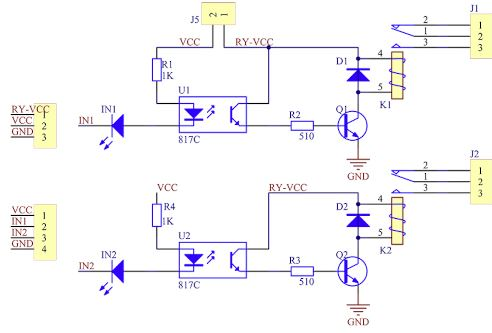
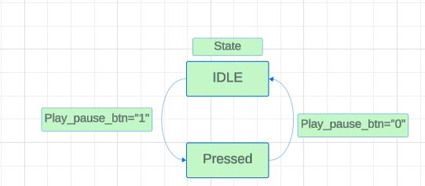
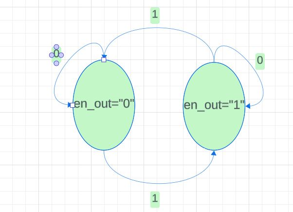

# Relay-Controlled Sound Synthesizer

## Team members

* Elsayed Yousef
* Thant Myat Mon
* Rainha Octávio
* Shin Jiyeon

[Link to GitHub project folder](https://github.com/ElsayedYousef/Digital-Eletronics-Project)

## Project objectives

Project goal is to implement a sound synthesizer utilizing relays on the Nexys A7 FPGA board. Rather than generating audio signals directly, the system employs relays connected to Pmod connectors to produce audible sounds by managing the activation and deactivation of relay switches. Users can compose and play basic melodies by programming the relay sequences. Push buttons will serve as controls for play, stop, and song navigation, while LEDs and a 7-segment display will provide visualization of the melody and information about the songs.

## Video

[Project Video Link](Video/)

## Software description
### Schematic

### Design Module code

## Components simulation 
### Testbench
### Simulation output

