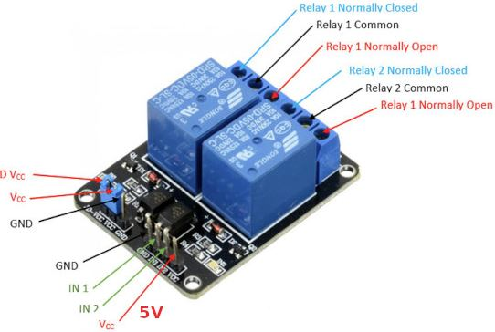

# Relay-Controlled Sound Synthesizer

## Team members

* Elsayed Yousef
* Thant Myat Mon
* Rainha Octávio
* Shin Jiyeon

[Link to GitHub project folder](https://github.com/ElsayedYousef/Digital-Eletronics-Project)

## Project objectives

Project goal is to implement a sound synthesizer utilizing relays on the Nexys A7 FPGA board. Rather than generating audio signals directly, the system employs relays connected to Pmod connectors to produce audible sounds by managing the activation and deactivation of relay switches. Users can compose and play basic melodies by programming the relay sequences. Push buttons will serve as controls for play, stop, and song navigation, while LEDs and a 7-segment display will provide visualization of the melody and information about the songs.

## Video

[Project Video Link](Video/)

## Software description
### Schematic
#### Play-Pause FSM

#### Song navigation FSM

### Design Module code
#### File for music:
File containing a counter to set the lenght of the music with four different music patterns based on the step sequencer.

[song file](Source%20files/musics_file.vhd)

#### File for clock counter:
Main counter of the project to set a suitable clock.

[Clock counter](Source%20files/Counter_music.vhd)

#### File for Leds:

[leds](Source%20files/Leds.vhd)

#### File for Seven segment:

[Seven segment](Source%20files/SevenSeg.vhd)

#### File for top level:

[top level](Source%20files/Top_level.vhd)

#### File for constraints:

[constraints](Source%20files/nexys-a7-50t.xdc)

#### File for play-pause:

[play-pause](Source%20files/play_pause.vhd)

#### File for Song navigator:

[song navigator](Source%20files/song_navigator.vhd)

## Components simulation 
### Testbench

#### Main counter Testbench files
[music_counter](Source%20files/tb_counter_music.vhd)

#### Music pattern  Testbench files
[music_files](Source%20files/tb_musics_file.vhd)

